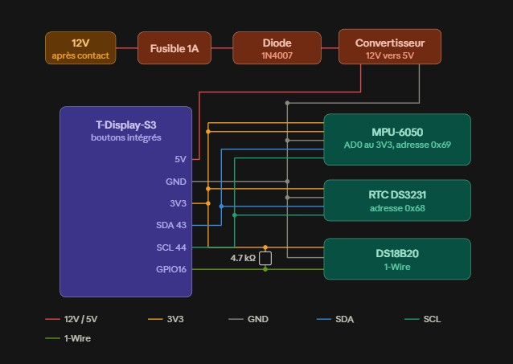

# Module Horloge / Inclinomètre — Suzuki Samurai SJ413

Remplacement de l'horloge d'origine du tableau de bord d'un Suzuki Samurai
SJ413 (2001) par un module numérique : heure, inclinomètre tangage / roulis
avec silhouettes du véhicule, température extérieure. Basé sur une carte
LilyGO T-Display-S3 (ESP32-S3 + écran IPS 1.9" 170x320), dans un boîtier
imprimé en 3D aux dimensions de la découpe d'origine (63 x 42 mm),
assemblage par clips sans vis.


## Sommaire

- [Fonctionnalités](#fonctionnalités)
- [Matériel](#matériel)
- [Liste des composants (BOM)](#liste-des-composants-bom)
- [Structure du dépôt](#structure-du-dépôt)
- [Câblage](#câblage)
- [Firmware](#firmware)
- [Les écrans](#les-écrans)
- [Impression 3D](#impression-3d)
- [Assemblage](#assemblage)
- [Réglages / dépannage](#réglages--dépannage)
- [Évolutions envisagées](#évolutions-envisagées)
- [Historique des révisions](#historique-des-révisions)

## Fonctionnalités

- **Inclinomètre** : écran coupé en deux verticalement — tangage à gauche
  (Samurai vu de profil, roue de secours à l'arrière), roulis à droite
  (vue arrière, roue de secours sur la porte, pneus sous la carrosserie).
  Les silhouettes pivotent par rapport à un horizon fixe.
- **Alerte à deux niveaux par axe** : ambre à l'approche du seuil, rouge
  avec cadre clignotant en critique. Chaque moitié est indépendante.
- **Horloge** temps réel, conserve l'heure véhicule débranché.
- **Température extérieure** par sonde étanche déportée.
- Navigation à 2 boutons — **ceux déjà intégrés à la carte**, aucun bouton
  supplémentaire à câbler.
- Port USB-C accessible depuis l'extérieur du boîtier.
- Mode simulation intégré : tout le firmware tourne sans aucun capteur.

## Matériel

La carte est une **LilyGO T-Display-S3**. Deux points la caractérisent et
conditionnent tout le reste du projet :

**L'écran utilise un bus parallèle 8 bits, pas du SPI.** C'est contre-intuitif
et beaucoup de tutoriels se trompent. Il ne faut donc pas configurer
`User_Setup.h` à la main avec des broches SPI : un fichier de configuration
tout prêt existe (voir [Firmware](#firmware)).

**Ce bus consomme énormément de broches** : seules 13 GPIO sont sorties sur
le connecteur, contre une vingtaine sur la plupart des cartes ESP32-S3. Le
projet en utilise 5, il reste donc de la marge, mais ça se planifie.

La carte produit elle-même son 3,3 V : on lui fournit du 5 V sur sa broche
dédiée, et elle alimente tous les capteurs en 3,3 V depuis sa broche 3V3.
**Aucun capteur n'est alimenté en 5 V** — les GPIO de l'ESP32-S3 ne sont pas
tolérants au 5 V, et cette règle élimine tout risque d'en envoyer sur une
entrée par accident.

## Liste des composants (BOM)

| Composant | Spécifications | Qté | Rôle |
| :--- | :--- | :---: | :--- |
| Carte microcontrôleur | LilyGO T-Display-S3 (ESP32-S3, écran IPS 1.9" 170x320, ST7789 parallèle 8 bits) | 1 | Cerveau + affichage + boutons |
| Capteur d'inclinaison | MPU-6050 (6 axes, I2C) | 1 | Tangage / roulis |
| Horloge temps réel | Module RTC DS3231 + pile CR2032 | 1 | Garde l'heure hors tension |
| Sonde de température | DS18B20 étanche, câble 1,5–2 m (1-Wire) | 1 | Température extérieure |
| Résistance | 4,7 kΩ | 1 | Tirage de la ligne 1-Wire |
| Alimentation | Convertisseur DC-DC step-down 12V → 5V, 3A | 1 | Adapte le 12V véhicule |
| Protection | Diode 1N4007 + porte-fusible 1A | 1 lot | Protège du réseau 12V |
| Câblage | Fil souple 24 AWG, gaine thermo, câble Qwiic/JST | 1 lot | Connexions |
| Impression 3D | Filament PETG ou ASA noir mat | ~60 g | Façade + boîtier |

Coût estimé (hors imprimante) : **35–50 €**.

Les micro-boutons silicone 8x8 mm figuraient dans les versions précédentes :
ils ne sont plus nécessaires, les deux boutons de la carte (BOOT et KEY)
tombent exactement sur les broches prévues. La façade conserve toutefois
leurs emplacements dans le fichier CAO, à percer ou non selon le choix
d'implantation finale.

## Structure du dépôt

```
.
├── README.md
├── wiring.jpg
├── firmware/
│   ├── samurai_dashboard/          # firmware principal
│   │   └── samurai_dashboard.ino
│   ├── 00_test_hello_world/        # validation matérielle
│   │   └── 00_test_hello_world.ino
│   └── 01_ecran_inclinometre/      # écran inclinomètre seul
│       └── 01_ecran_inclinometre.ino
└── cad/
    ├── 01_facade_samurai.scad
    └── 02_boitier_corps.scad
```

Chaque croquis est dans un dossier à son nom : c'est ce qu'exige l'IDE
Arduino.

Les deux fichiers `.scad` partagent le même repère de coordonnées et les
mêmes variables (`largeur_trou`, `largeur_patte`, `x_patte_trou`) — une
dimension modifiée doit être reportée dans les deux.

## Câblage



Convention de lecture : un point noir = connexion réelle ; un croisement de
fils sans point = pas de contact.

### Affectation des broches

| Signal | GPIO | Remarque |
| :--- | :--- | :--- |
| I2C SDA / SCL | 43 / 44 | Connecteur Qwiic / STEMMA QT |
| DS18B20 | 16 | 1-Wire |
| Boutons | 0 (BOOT) / 14 (KEY) | Déjà intégrés à la carte |
| Alimentation périphériques | 15 | **Réservé** — doit rester HIGH |
| Rétroéclairage | 38 | **Réservé** |

Le **connecteur Qwiic** de la carte sort déjà 3V3, GND, SDA et SCL sur une
prise JST 4 points : les capteurs I2C s'y chaînent avec des câbles tout
faits, sans soudure. Dans un boîtier encastré qui vibre, c'est nettement
plus fiable que des fils volants.

Les sources documentaires se contredisent sur les broches I2C par défaut
(43/44 ou 18/17 selon les pages). Vérifiez le marquage de votre carte ;
de toute façon `Wire.begin(SDA, SCL)` permet de les imposer.

### Conflit d'adresses I2C — à ne pas rater

Le MPU-6050 et le DS3231 occupent **tous deux l'adresse 0x68** par défaut.
Il faut relier la broche **AD0 du MPU-6050 au 3V3** pour le basculer en
**0x69**, ce que le firmware attend (`ADRESSE_MPU`). Sans ce cavalier, les
deux capteurs se marchent dessus et aucun ne répond correctement.

### Autres points

- **Masse commune obligatoire** entre convertisseur, carte et capteurs.
  C'est le fil le plus souvent oublié, et la première cause de bus I2C muet.
- **DS18B20** : résistance de 4,7 kΩ entre la ligne de données et le 3V3,
  sauf si votre module l'intègre déjà. Le câble étant long, placez-la côté
  carte, pas côté sonde.
- **Sens de la diode** : bague côté convertisseur, sinon rien ne s'allume.
- **Alimentez sur le +12V après contact**, pas sur le permanent, sinon le
  module tourne en continu et vide la batterie en quelques jours. Le DS3231
  garde l'heure grâce à sa pile.

## Firmware

### Configuration préalable de TFT_eSPI (une seule fois)

Dans le dossier de la bibliothèque `TFT_eSPI`, ouvrir `User_Setup_Select.h`,
commenter la ligne active et décommenter :

```cpp
#include <User_Setups/Setup206_LilyGo_T_Display_S3.h>
```

Ne modifiez pas `User_Setup.h` à la main : cette carte est en parallèle
8 bits, un brochage SPI trouvé sur un blog ne fonctionnera pas. Ce fichier
est **écrasé à chaque mise à jour de la bibliothèque** — si l'écran redevient
noir sans raison, c'est presque toujours ça.

### Réglages Arduino IDE

| Option | Valeur |
| :--- | :--- |
| Carte | ESP32S3 Dev Module |
| USB CDC On Boot | Enabled |
| Flash Size | 16MB (128Mb) |
| Partition Scheme | 16M Flash (3M APP/9.9MB FATFS) |
| PSRAM | **OPI PSRAM** |
| USB Mode | CDC and JTAG |

LilyGO signale que `TFT_eSPI` ne fonctionne pas correctement avec les
versions du paquet **esp32 supérieures à 2.0.14**. Écran noir alors que tout
le reste semble bon : redescendez en 2.0.14.

### Bibliothèques

`TFT_eSPI` (Bodmer), `Adafruit MPU6050` + `Adafruit Unified Sensor`,
`RTClib` (Adafruit), `OneWire` + `DallasTemperature` (Miles Burton).

### Mode simulation

En tête de `samurai_dashboard.ino` :

```cpp
#define SIMULATION 1
```

À `1`, tout tourne **sans aucun capteur branché** : angles sinusoïdaux
balayant les trois niveaux d'alerte, heure interne, température factice.
À `0`, les capteurs réels sont utilisés. Les deux chemins de compilation
sont indépendants — en simulation, aucune bibliothèque de capteur n'est
même incluse.

### Ordre de mise en route conseillé

1. `00_test_hello_world` — valide écran, boutons et liaison série. Rien de
   branché, juste l'USB-C.
2. `01_ecran_inclinometre` — l'écran inclinomètre seul, en simulation.
3. `samurai_dashboard` en `SIMULATION 1` — l'ensemble des modes.
4. Câbler les capteurs, passer en `SIMULATION 0`.

### Premier réglage de l'heure

Décommenter **une seule fois** la ligne `rtc.adjust(...)` dans `setup()`,
téléverser, puis la recommenter et téléverser à nouveau — sinon l'heure
repart à la date de compilation à chaque redémarrage.

### Commandes

| Action | Effet |
| :--- | :--- |
| KEY, appui court | Mode suivant (inclinomètre → horloge → veille) |
| BOOT, appui long | Calibrage du zéro de l'inclinomètre |

Le calibrage se fait **véhicule à plat, moteur arrêté** : il moyenne 16
lectures et mémorise l'écart comme nouvelle référence.

## Les écrans

### Inclinomètre

L'écran est coupé en deux verticalement. À gauche le tangage avec le Samurai
vu de profil ; à droite le roulis avec la vue arrière. Une ligne d'horizon
en pointillés reste fixe : c'est le véhicule qui bascule par rapport à elle,
comme sur un horizon artificiel.

Les silhouettes sont tracées en trigonométrie, pas en bitmap : elles
pivotent réellement, sans stocker d'images.

**Saturation graphique :** la silhouette de profil est longue, donc au-delà
de ~34° ses extrémités viendraient chevaucher le titre et la valeur. Le
dessin est donc saturé à cette limite, **mais la valeur numérique affichée
reste toujours l'angle réel**. C'est le comportement des vrais indicateurs :
le graphique bute, le chiffre continue.

### Seuils d'alerte

| Niveau | Silhouette | Titre + valeur | Cadre |
| :--- | :--- | :--- | :--- |
| Normal | vert | blanc | — |
| Approche | ambre | ambre | — |
| Critique | rouge | rouge | rouge clignotant |

Valeurs par défaut : roulis 22° / 30°, tangage 27° / 35°. Le roulis est plus
bas car sur un Samurai (empattement court, voie étroite, centre de gravité
haut) c'est le basculement latéral le vrai danger ; en montée on perd
l'adhérence ou on recule bien avant de basculer.

> **Ces valeurs sont un point de départ volontairement conservateur, pas
> une limite constructeur.** L'angle réel de bascule dépend des pneus, d'un
> éventuel rehaussement, du chargement et surtout d'une galerie de toit — un
> Samurai réhaussé et chargé sur le toit part nettement plus tôt. Et un angle
> qui se tient à l'arrêt ne se tient pas en dynamique : une bosse, un
> freinage, un passager qui se déplace suffisent. Cet écran est une aide à la
> lecture du terrain, **jamais une autorisation d'aller jusqu'au seuil**. Si
> vous ajustez ces constantes, faites-le vers le bas.

### Horloge

Heure en grands chiffres, secondes, date et température extérieure. Dessinée
directement sur l'écran sans sprite : le contenu ne change qu'une fois par
seconde, et cela économise les 108 Ko qu'occuperait un sprite plein écran.

## Impression 3D

- Matière : **PETG ou ASA** noir mat. Le PLA se déforme l'été derrière un
  pare-brise (>60 °C dans l'habitacle).
- Hauteur de couche 0,16–0,20 mm, remplissage 20–30 %.
- Façade : face visible contre le plateau, sans support.
- Boîtier : à plat, ouverture vers le haut ; supports légers sous la découpe
  USB-C selon le trancheur.

Les deux fichiers ont été rendus avec OpenSCAD et vérifiés en maillage
2-manifold valide. L'alignement pattes / encoches a été contrôlé
numériquement sur les trois axes.

## Assemblage

1. Relier AD0 du MPU-6050 au 3V3 (adresse 0x69), puis chaîner MPU-6050 et
   DS3231 sur le connecteur Qwiic.
2. Câbler la sonde DS18B20 sur GPIO16 avec sa résistance de tirage.
3. Glisser l'électronique dans le boîtier par l'avant : le PCB bute contre
   l'étagère interne (5 mm), juste derrière la fenêtre de l'écran.
4. Passer le câble 12V/GND par l'ouverture arrière, brancher le
   convertisseur avec diode et fusible en amont.
5. Clipser la façade : les deux pattes s'enfoncent par friction dans les
   encoches. Appuyer fermement et de façon répartie sur toute la largeur,
   pas sur un coin.
6. Insérer dans la découpe du tableau de bord — le débord de 2,5 mm masque
   les bords et les fentes des encoches.
7. Téléverser, régler l'heure du RTC, calibrer le zéro véhicule à plat.

## Réglages / dépannage

| Symptôme | Cause probable |
| :--- | :--- |
| Écran noir | `Setup206` non sélectionné dans `User_Setup_Select.h`, ou paquet esp32 > 2.0.14 |
| Écran noir hors USB | GPIO15 non mis à HIGH |
| Téléversement impossible | Maintenir BOOT, appuyer sur RST, relâcher RST puis BOOT |
| Capteurs I2C muets | AD0 du MPU non relié au 3V3 (conflit 0x68), ou masse non commune |
| Température à `--` | Sonde absente ou résistance de tirage manquante |
| Heure fausse au démarrage | Pile CR2032 vide, ou `rtc.adjust(...)` jamais exécuté |
| Silhouette penchée à l'envers | Inverser `SENS_TANGAGE` ou `SENS_ROULIS` (1 ↔ -1) |
| Clip trop lâche ou trop dur | Ajuster `epaisseur_patte` par pas de 0,1 mm, réimprimer la façade seule |

## Évolutions envisagées

**Boussole.** Le MPU-6050 est un 6 axes, il n'a pas de magnétomètre : il
faut un module supplémentaire (QMC5883L « GY-271 », ~2 €, adresse 0x0D). La
difficulté n'est pas le module mais l'environnement : encastré dans un
tableau de bord en acier, à côté de l'écran et du WiFi, il exige une
calibration hard-iron/soft-iron **faite dans le véhicule, module en place**,
à refaire si quoi que ce soit bouge. Il faut aussi le compenser en
inclinaison — l'accéléromètre du MPU-6050 est déjà là pour ça.

**GPS.** Un ATGM336H (~5 €) ou un NEO-M8N (~12 €) sur UART donne le cap réel
et la vitesse. Le cap GPS n'existe qu'**en mouvement** (au-delà de ~5 km/h),
le magnétomètre est le plus perturbé en roulant : les deux se complètent,
avec un basculement automatique selon la vitesse. Prévoir impérativement un
module à connecteur **IPEX** et une **antenne active déportée** — dans une
cage métallique, une antenne céramique intégrée n'accrochera jamais.

Le GPS pourrait remplacer le DS3231, mais mieux vaut garder le RTC :
l'accrochage prend de 30 s à plusieurs minutes, et jamais en parking
souterrain. Le RTC donne l'heure immédiatement, le GPS le resynchronise.

**Voltmètre batterie**, par pont diviseur sur une entrée ADC.

## Historique des révisions

- **v3** — Correction de deux erreurs importantes des versions précédentes :
  l'écran est en **parallèle 8 bits et non en SPI** (avec le fichier
  `Setup206` à sélectionner, au lieu d'une configuration manuelle vouée à
  l'échec), et le **conflit d'adresse I2C 0x68** entre MPU-6050 et DS3231
  (AD0 au 3V3 → 0x69). Ajout de l'écran inclinomètre avec silhouettes de
  Samurai, alertes à deux niveaux par axe, mode simulation complet, tableau
  d'affectation des broches, suppression des boutons externes au profit de
  ceux de la carte, clarification de l'alimentation en 3,3 V.
- **v2** — Correction d'un maillage STL non-manifold sur la façade,
  correction des 4 premiers mm du boîtier pleins par erreur, réalignement
  vérifié des clips, clip par crochet remplacé par un clip par interférence,
  ré-ajout du RTC et de la sonde de température au BOM, anti-rebond du
  firmware rendu non bloquant.
- **v1** — Version initiale.
